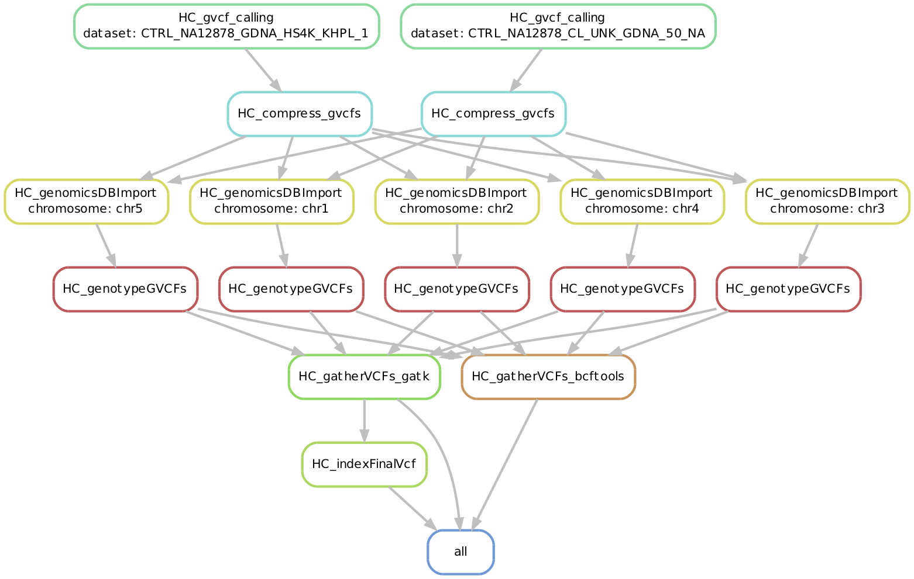
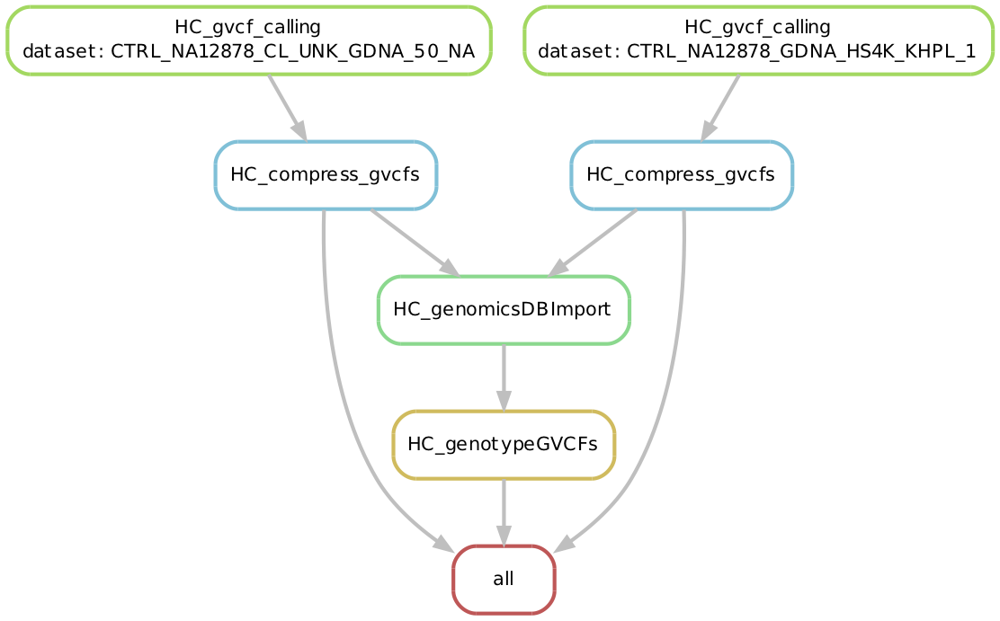

# VariantCallingPipeline-Germline-HC4
## CGR's Germline Variant Calling Pipeline with SnakeMake and GATK4

## Introduction
This Pipeline will serve as a CGR WGS/WES Germline Variant calling pipeline for external projects (non-production builds). Current plan is to have this pipeline take calibrated BAMs as input and have it generate a compressed and indexed VCF file as Final output.

## Outline of the workflow:

## Status

* Current Work:
  + Testing GATK 4
  + Testing Snakemake as an alternative for workflow management insted of Bash/AWK workflow thats being used currently for current Germline V3 Pipeline
  + Testing NEW HaplotypeCaller Workflow in GATK 4
  + Testing GenomicsDBIImport Module
  + Testing GenotypeGVCF module (differnt from GATK 3's GenotypeGVCF)
  
* Future Work:
  + Adding Scatter and Gather Workflow for GenomicsDBIImport (to optimize for WGS/WES analysis)
  + Adding Concatenation Workflow after GenotypeGVCF 
  + Adding Different Cores and SGE environment for different rules
  + Integrating Conda to run multiple environments of Python
  + Building better Control over cluster SGE parameters..for eg- Job Name according to Rule & Sample ID
  + Directing Logs to Rules Folders for better management
  
## Features
* Pipeline-Automation-ErrorTrackingSpecific Features
  + "Protected" output VCF files
  + Directory Feature added to the Snakemake to check for timestamp
  + Flags added to monitor Pipeline Completion
  + Has the capacity to remember  when a job is terminated without comletion or without a warning (for e.g. - random cluster failures)
  + Stict Bash Mode (Error Handling). Non-Zero error Status means failure
  + Can detect incomplete results' files
  + Added option to check for Zero-Size files
  + Support for Customized Cores/Multi-threading per Rule (or step in the pipeline)
  
## Pipeline/HPC Failure Scenarios Test
  1. Job failure by itself. (java error, memory issue, core dump, etc.)
      + without output.
      + with partial output.
  2. Job failed due to cluster issue. (job killed by the cluster)
      + without output.
      + with partial output.
  3. Job entered in to eqw/dr status (not easy to simulate, let’s be creative here)
  4. Job stuck in the “r” status (Snakemake will simply wait under this situation, which is expected and not very harmful, other than wasting computational time until the user realizes it)   
  5. Any other error scenario…?
      + How to work with Empty or Incomplete Directories
      + Resumability of an analyis (for example - gvcf generation job) from the beginning or from the point it got interrupted??
      + Voluntary Termination vs Interupted Jobs
  
  