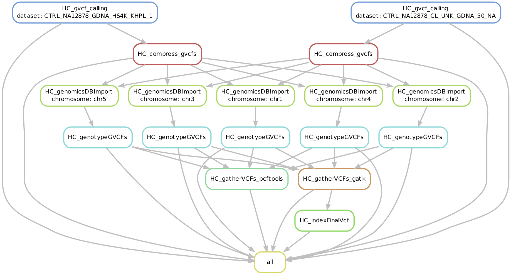

# VariantCallingPipeline-Germline-HC4
## CGR's Germline Variant Calling Pipeline with SnakeMake and GATK4

## Introduction
This Pipeline will serve as a CGR WGS/WES Germline Variant calling pipeline for external projects (non-production builds). Current plan is to have this pipeline take calibrated BAMs as input and have it generate a compressed and indexed VCF file as Final output.

## Outline of the workflow:

## Status

* Current Work:
  + Testing GATK 4
  + Testing Snakemake as an alternative for workflow management insted of Bash/AWK workflow thats being used currently for current Germline V3 Pipeline
  + Testing NEW HaplotypeCaller Workflow in GATK 4
  + Testing GenomicsDBIImport Module
  + Testing GenotypeGVCF module (differnt from GATK 3's GenotypeGVCF)
  
* Future Work:
  + Adding Scatter and Gather Workflow for GenomicsDBIImport (to optimize for WGS/WES analysis)
  + Adding Concatenation Workflow after GenotypeGVCF 
  + Adding Different Cores and SGE environment for different rules
  
## Features
* Pipeline-Automation-ErrorTrackingSpecific Features
  + "Protected" output VCF files
  + Directory Feature added to the Snakemake to check for timestamp
  + Flags to be added to monitor Pipeline Completion
  